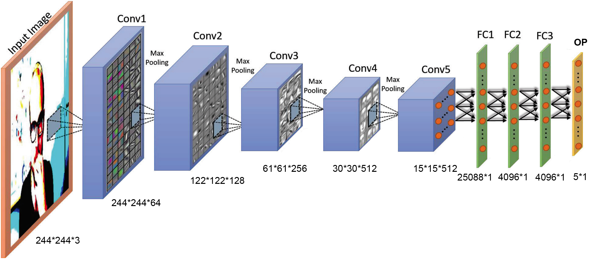
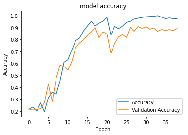

## Use VGG16 for hand gesture prediction

### Introduction

VGG16 (**V**isual **G**eometry **G**roup) is a CNN (**C**onvolution **N**eural **N**et ) architecture developed by University of Oxford. It has 16 weighted layers. We chose this model because it is considered to be one of the most distinguished computer vision model architecture. VGG16 has 5 convolution layers group, each consists of 2 or 3 conv layers. They focused on having convolution layers of 3x3 filter with a stride 1 and always used same padding and maxpool layer of 2x2 filter of stride 2. It follows this arrangement of convolution and max pool layers consistently throughout the whole architecture. For output it has 3 FC (fully connected layers) followed by a softmax. This network is a pretty large network and it has about 134 million (approx) parameters.

For this project, for one of the implementation methods, we built a VGG16 network from scratch. (For details please look at [**handGestureVGGModel.ipynb**](https://github.com/leelightman/HandGestureRecognizer/blob/master/Code/handGestureVGGModel.ipynb))

### Layer explain

Model: "sequential_1" _________________________________________________________________ 

| Layer (type)                  | Output Shape                  | Param #                 |
| ----------------------------- | ----------------------------- | ----------------------- |
| conv2d_1 (Conv2D)             | (None, 244, 244, 64)          | 1792                    |
| conv2d_2 (Conv2D)             | (None, 244, 244, 64)          | 36928                   |
| max_pooling2d_1 (MaxPooling2) | (None, 122, 122, 64)          | 0                       |
| conv2d_3 (Conv2D)             | (None, 122, 122, 128)         | 73856                   |
| conv2d_4 (Conv2D)             | (None, 122, 122, 128)         | 147584                  |
| max_pooling2d_2 (MaxPooling2) | (None, 61, 61, 128)           | 0                       |
| conv2d_5 (Conv2D)             | (None, 61, 61, 256)           | 295168                  |
| conv2d_6 (Conv2D)             | (None, 61, 61, 256)           | 590080                  |
| conv2d_7 (Conv2D)             | (None, 61, 61, 256)           | 590080                  |
| max_pooling2d_3 (MaxPooling2) | (None, 30, 30, 256)           | 0                       |
| conv2d_8 (Conv2D)             | (None, 30, 30, 512)           | 1180160                 |
| conv2d_9 (Conv2D)             | (None, 30, 30, 512)           | 2359808                 |
| conv2d_10 (Conv2D)            | (None, 30, 30, 512)           | 2359808                 |
| max_pooling2d_4 (MaxPooling2) | (None, 15, 15, 512)           | 0                       |
| conv2d_11 (Conv2D)            | (None, 15, 15, 512)           | 2359808                 |
| conv2d_12 (Conv2D)            | (None, 15, 15, 512)           | 2359808                 |
| conv2d_13 (Conv2D)            | (None, 15, 15, 512)           | 2359808                 |
| max_pooling2d_4 (MaxPooling2) | (None, 7, 7, 512)             | 0                       |
| flatten_1 (Flatten)           | (None, 25088)                 | 0                       |
| dense_1 (Dense)               | (None, 4096)                  | 102764544               |
| dense_2 (Dense)               | (None, 4096)                  | 16781312                |
| dense_3 (Dense)               | (None, 5)                     | 20485                   |
| Total params: 134,281,029     | Trainable params: 134,281,029 | Non-trainable params: 0 |

Figure taken from [[2]](https://bura.brunel.ac.uk/bitstream/2438/14803/1/FullText.pdf) with modification

### Accuracy

Max Validation Accuracy: 0.9087837934494019

Max Accuracy: 1

Min Loss: 0.006036893437759807

### Result

[Link to Video](https://drive.google.com/open?id=1uDyKOb6X-R4Ju5196eYVg2bNBCSeRFZI)

### Biblography

[1] [Very Deep Convolutional Networks for Large-Scale Image Recognition][https://arxiv.org/pdf/1409.1556.pdf]

[2] [Artificial Intelligent System for Automatic Depression Level Analysis through Visual and Vocal Expressions][https://bura.brunel.ac.uk/bitstream/2438/14803/1/FullText.pdf]

